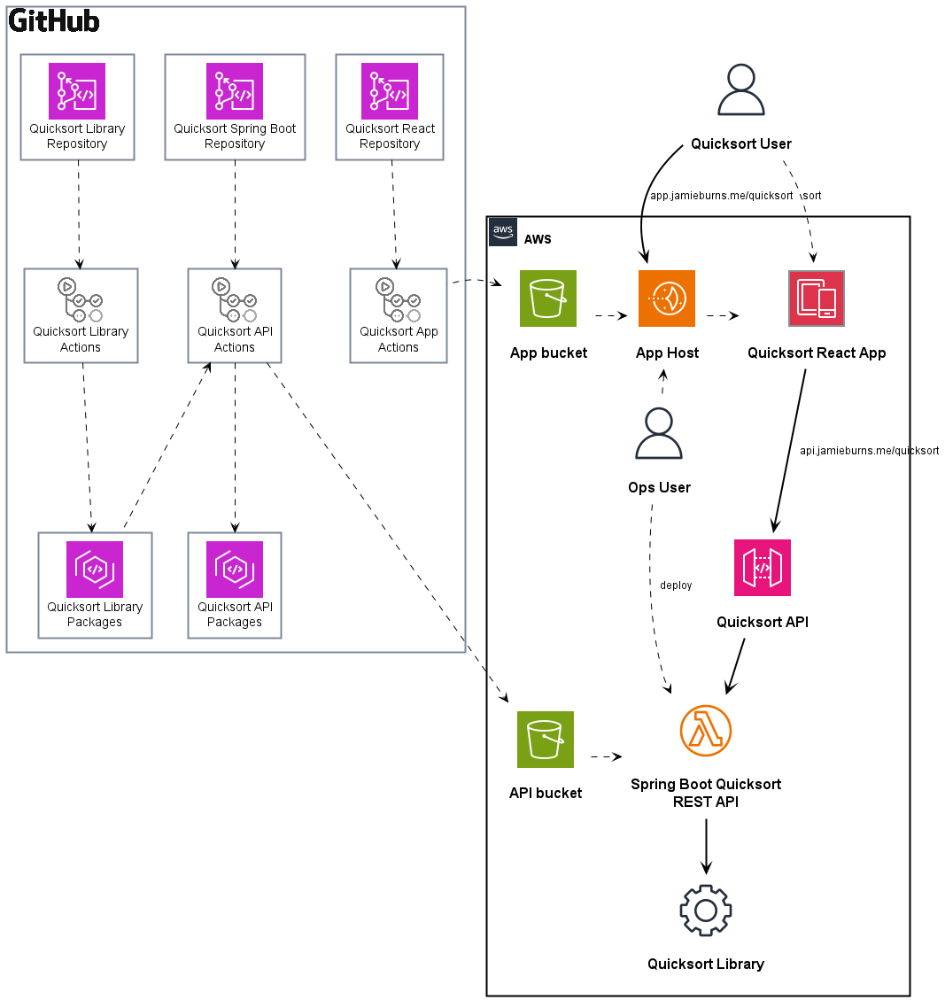

## Quicksort React App

Interviewers are asking for demonstrated React, Spring Boot, API and DevOps skills. Coding assessments have been focussing on data structures and algorithms. Quicksort React App was created to showcase these.

Quicksort React App is a React+NextJs+TailwindCSS app hosted on an AWS Lightsail instance backed by a Spring Boot REST API hosted as an AWS Lambda Function fronted by an AWS API Gateway. Code is git shosted in GitHub repositories and built with GitHub Actions build pipelines. For more information, see the [Infrastructure diagram](#Infrastructure) below.

For source code, see
- [Quicksort React App](https://github.com/jamie-burns0/quicksort-react)
- [Quicksort Spring Boot API](https://github.com/jamie-burns0/quicksort-springboot)
- [Quicksort Java library](https://github.com/jamie-burns0/quicksort)

A feature of this Quicksort implementation is that it takes an iterative approach to divide-and-conquer rather than a typical recursive approach. So instead of creating a stack of call stacks, we just create a stack of array indicies. The inspiration for taking an iterative approach over a recursive approach was the session, ["Leslie Lamport: Thinking Above the Code"](https://youtu.be/-4Yp3j_jk8Q?si=zUVjCimSVJl5uynG), from the Microsoft Research Facilty Summit 2014.

The other feature of this implementation is for the pivot value, we take the middle value of the range of integers we are ordering. This generally results in a faster Quicksort.

For more information on Hoare's Quicksort algorithm, see https://en.wikipedia.org/wiki/Quicksort

For more information about quicksort, see https://www.programiz.com/dsa/quick-sort

## Infrastructure

Infrastructure diagram was created using [PlantUML](https://plantuml.com/) - see [quicksort-react-tech-stack.puml](https://github.com/jamie-burns0/quicksort-react-doc/blob/main/quicksort-react-tech-stack.puml)

